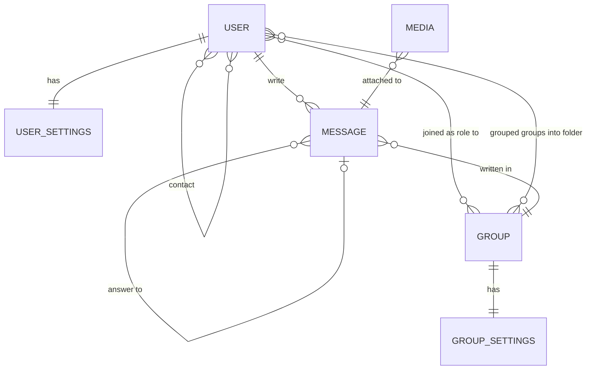

# Entity-relationship diagram

# Models

`USER`: Represents individual users.  
`GROUP`: Represents a group of users.  
`USER_SETTINGS`: Represents user settings.
`GROUP_SETTINGS`: Represents group settings.
`MESSAGE`: Represents individual messages sent or received.  
`MEDIA`: Represents various forms of media that can be attached to messages.

# Relations

## USER with USER

Represents a many-to-many relationship between users, indicating that users can be in contact with multiple other users and vice versa. This could signify connections or relationships between users.

## USER with USER_SETTINGS

Represents a one-to-one relationship between USER and USER_SETTINGS, indicating that each user has one specific set of settings associated with them. Each user's settings are unique and directly linked to that user.

## GROUP with GROUP_SETTINGS

Represents a one-to-one relationship between GROUP and GROUP_SETTINGS, implying that each group has one specific set of settings associated with it.

## USER with MESSAGE

Represents a one-to-many relationship between USER and MESSAGE, indicating that a user can write multiple messages, but each message is written by only one user.

## MESSAGE with MESSAGE

Represents a many-to-one relationship between messages, indicating that many messages can be responses or answers to a single specific message.

## USER with GROUP

Represents a many-to-many relationship between users and groups, where users can be associated with multiple groups, and a group can have multiple users in various roles.

## USER with GROUP

Represents a many-to-many relationship between users and groups, indicating that users can organize or group multiple groups into various folders, and a folder can contain multiple groups.

## MESSAGE with GROUP

Represents a one-to-many relationship between MESSAGE and GROUP, indicating that a message can be associated with one or more groups.

## MEDIA with GROUP

Represents a many-to-one relationship between MEDIA and MESSAGE, indicating that a message can have multiple types of media attached to it, but each media attachment belongs to only one message.
