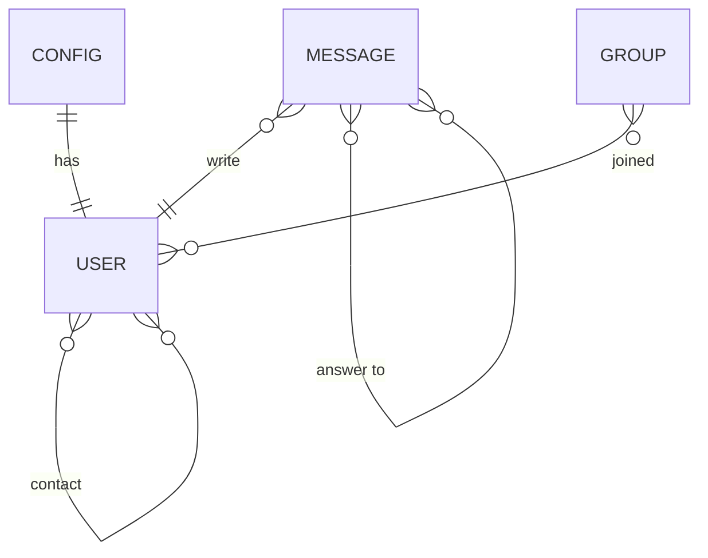

# Entity-relationship diagram

# Models

`USER`: Represents individual users.  
`CONFIG`: Represents configurations or settings.  
`MESSAGE`: Represents individual messages sent or received.  
`GROUP`: Represents a group of users.

# Relations

## USER with USER

Represents a many-to-many relationship between users, indicating that users can be in contact with multiple other users and vice versa. This could represent a social network-like relationship where users can communicate with each other.

## USER with CONFIG

This notation signifies a one-to-one relationship, indicating that each user has one specific configuration, and that configuration is owned by that user exclusively. This relationship implies a direct mapping between a user and their unique configuration settings within the system.

## USER with MESSAGE

Represents a one-to-many relationship between USER and MESSAGE, indicating that a user can write multiple messages, but each message is written by only one user.

## MESSAGE with MESSAGE

Represents a many-to-many relationship between messages, indicating that a message can be an answer to multiple other messages, and vice versa. This could represent threaded or nested messages where one message is a reply to another.

## GROUP with USER

Represents a many-to-many relationship between GROUP and USER, indicating that users can join multiple groups, and a group can have multiple users as members.
