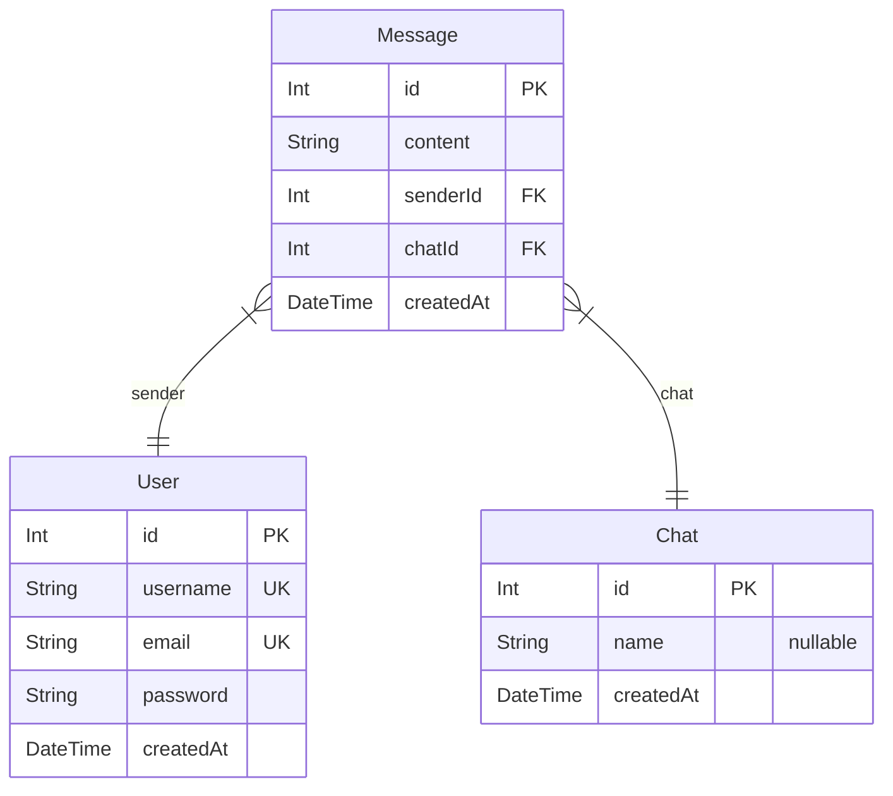

# Messenger

> Generated by [`prisma-markdown`](https://github.com/samchon/prisma-markdown)

- [default](#default)

## default

### `User`

**Properties**

- `id`:
- `username`:
- `email`:
- `password`:
- `createdAt`:

### `Message`

**Properties**

- `id`:
- `content`:
- `senderId`:
- `chatId`:
- `createdAt`:

### `Chat`

**Properties**

- `id`:
- `name`:
- `createdAt`:
